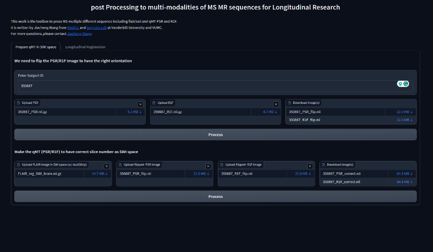
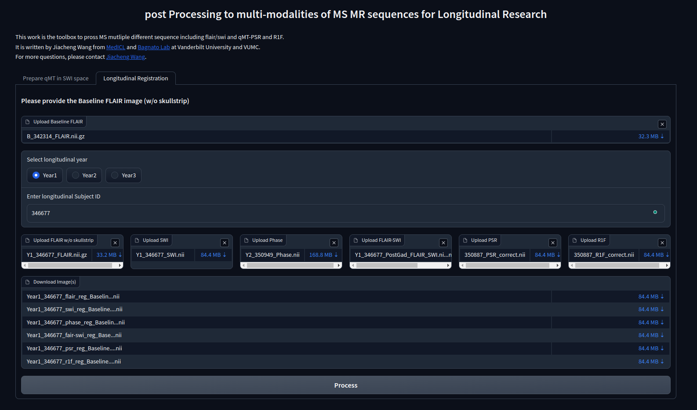

## An easy-to-play Tool for MS multisequence preprocessing
Author: [Jiacheng Wang](https://jackywang22.github.io/) <br>
Copyright: [MedICL Lab](https://github.com/MedICL-VU) at Vanderbilt University and [Bagnato Lab](https://www.vumc.org/bagnato-lab/our-mission) at VUMC. <br>
The aim of this tool is to help physicians easily post-process multiple MS MR sequences. It also supports handling longitudinal data to have multi-sequence comparisons. The UI can help researchers easily visualize and process the data. More functions will keep updated... Please stay tuned.

## Prerequisite
- [ANTsPy](https://pypi.org/project/antspyx/) pip install antspyx 
- [Gradio](https://www.gradio.app/) pip install gradio
- python=3.9.0


## Main functions
1. Support the reslicing of qMT sequences (PSR/R1F) to have the same space as the SWI sequences.
<p float="left" align="center">
 
<figcaption align="center">
This is an example of this function. It supports the re-orientation function in which it is flipped horizontally in the axial planar. However, in the future, the auto re-orientation function will be applied. Then it supports the matching from the qMT space to the SWI space
</figcaption>
</p>

1. Support longitudinal analysis to register Year-1, Year-2, ... to Baseline scan. We utilize FLAIR (in SWI space) from longitudinal studies and apply the transform to other modalities.
<p float="left" align="center">
 
<figcaption align="center">
This is an example of this function. We can select the baseline FLAIR as a reference and upload the modalities in the longitudinal studies. We will study the missing modalities issue. Please stay tuned....
</figcaption>
</p>

## To run this Tool UI
```
python main.py
```
It will show the localhost link to access

## Please check out our other work in MS

1. [SSL2](https://arxiv.org/abs/2303.05026): We studied how to leverage self-supervised learning and semi-supervised learning in limited data segmentation in 7T MS dataset
2. [Using Phase Patterns to Differentiate Lesion Severity in Multiple Sclerosis](https://scholar.google.com/citations?view_op=view_citation&hl=zh-TW&user=QMJb-tUAAAAJ&sortby=pubdate&citation_for_view=QMJb-tUAAAAJ:eQOLeE2rZwMC) (ACTRIMS 2023): We studied to enlarge our study in Phase modality in which we found a crucial biomarker for MS diagnosis.

## Reference:
```bibtex
@inproceedings{wang2023ssl2,
  title={SSL2 Self-Supervised Learning meets semi-supervised learning: multiple clerosis segmentation in 7T-MRI from large-scale 3T-MRI},
  author={Wang, Jiacheng and Li, Hao and Liu, Han and Hu, Dewei and Lu, Daiwei and Yoon, Keejin and Barter, Kelsey and Bagnato, Francesca and Oguz, Ipek},
  booktitle={Medical Imaging 2023: Image Processing},
  volume={12464},
  pages={126--136},
  year={2023},
  organization={SPIE}
}
```
```
@article{actrims2023,
	title ={ACTRIMS Forum 2023},
	journal = {Multiple Sclerosis Journal},
	volume = {29},
	number = {2\_suppl},
	pages = {P283},
	year = {2023},
	doi = {10.1177/13524585231169436}
	}
```

